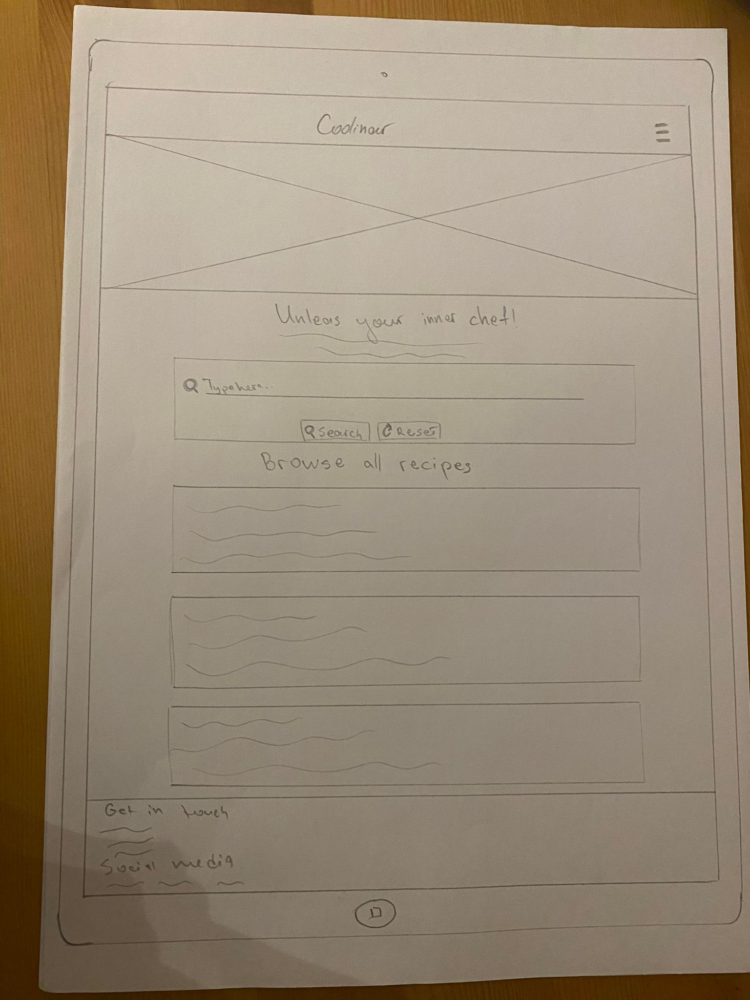
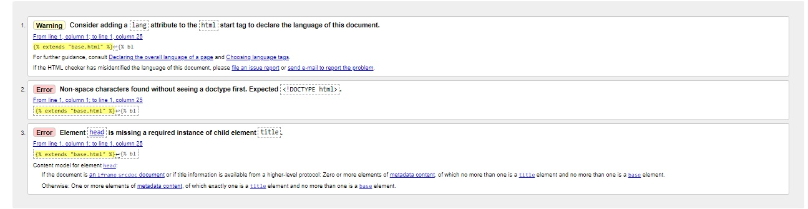

# **Coolinar** 

## **Introduction** ##

**Coolinar is an online recipe book/kitchen utensils shop where you'll find easy-to-follow recipes, essential kitchen tools, and enough inspiration to turn that sad instant ramen into a masterpiece (okay, maybe not a masterpiece, but definitely an edible creation!).**

**Developer: Stanimir Vasev**

[Visit live website](https://recipe-book-ci-project-e8e717596d40.herokuapp.com/)

## Table of Content

- [Coolinar](#coolinar)
  - [Table of Content](#table-of-content)
  - [Project Goals](#project-goals)
    - [User Goals](#user-goals)
    - [Site Owner Goals](#site-owner-goals)
  - [User Experience](#user-experience)
    - [Target Audience](#target-audience)
    - [User Requirements](#user-requirements)
    - [User Expectations](#user-expectations)
  - [User Stories](#user-stories)
    - [Site User](#site-user)
    - [Site Owner](#site-owner)
  - [Design](#design)
    - [Colour Scheme](#colour-scheme)
    - [Fonts](#fonts)
    - [Copy](#copy)
    - [Images and icons](#images-and-icons)
    - [Structure](#structure)
    - [Wireframes](#wireframes)
  - [Technologies and Languages Used](#technologies-and-languages-used)
  - [Existing features](#existing-features)
    - [Navbar](#navbar)
    - [Home page](#home-page)
    - [Add New Recipe](#add-new-recipe)
    - [About page](#about-page)
    - [Shop page](#shop-page)
    - [Register page](#register-page)
    - [My Profile page](#my-profile-page)
    - [Log in page](#log-in-page)
    - [Log out page](#log-out-page)
    - [Flash messages](#flash-messages)
    - [Footer](#footer)
  - [Potential new features](#potential-new-features)
  - [Testing and validation](#testing-and-validation)
    - [HTML validation](#html-validation)
    - [CSS validation](#css-validation)
    - [JavaScript validation](#javascript-validation)
    - [Python validation](#python-validation)
    - [Lighthouse](#lighthouse)
    - [Other manual tests](#other-manual-tasks)
    - [Known Bugs](#known-bugs)
  - [Deployment](#deployment)
    - [Deployment and Cloning](#deployment-and-cloning)
    - [Deployment to Heroku](#deployment-to-heroku)
  - [Credits](#credits)
    - [Code](#code)
  - [Disclaimer](#disclaimer)

## Project Goals

The goal of this project was to develop an interactive and user-friendly Flask application that serves as a recipe book and has a shop for kitchen utensils. It allows users to browse, search, and manage recipes from various cultures and dietary needs. Users can register and log in to add, edit, and delete their own recipes so other members of the food enthusiast community can enjoy their favourite dishes. The site provides all necessary cuisine/category information as well as ingredients, quantities and instructions to make each recipe.

### User Goals

- Users can discover new and exciting recipes from various cultures.
- Users can easily search for recipes based on recipe name, ingredients needed, cuisine or category.
- Logged-in users can add new recipes, edit their existing recipes, and delete recipes they no longer require.
- Users can find all necessary ingredients and tools needed as well as other recipe information such as calories, dietary preferences and more. 
- Users can find essential kitchen utensils and tools they might require to make any of those recipes and purchase them from our online shop.

### Site Owner Goals

- Create a one-stop shop for food enthusiasts where they can share their favourite recipes but also generate revenue to sustain the site from kitchen utensils sales.
- Encourage new users to register and explore the application's features. This can be achieved through effective marketing, improvements of the recipe book and adding extra functionality that allows users to speak with others in the community.
- Motivate users to return to the application frequently. This could involve implementing features that promote continuous engagement, like recipe recommendations, challenges, or loyalty programmes.
- Keep users engaged with fresh content and updates. This might include adding new recipes regularly, partnering with food bloggers or chefs for exclusive content, or incorporating seasonal recipe themes.

## User Experience

### Target Audience

- Home cooks who are interested in exploring new and exciting recipes but may not consider themselves expert chefs. This could include young professionals, families, or anyone who wants to elevate their home cooking skills.
- People who are health-conscious and interested in recipes that cater to specific dietary needs. 
- Individuals who enjoy food trends and experimenting with new cuisines.

### User Requirements

- The application should be easy to navigate and use, even for users who are not familiar with recipe apps.
- Recipe instructions should be easy to understand and follow, with clear steps and explanations.
- The application should be responsive and optimised for use on all devices.
- User data, such as account information and personal recipes, should be secure and protected.

### User Expectations

- Discoverability 
- Customisation
- Engaging content
- Seamless user experience
- Community features
- Contact information

## User Stories

### Site User

- I want to browse recipes categorised by cuisine and type so I can easily find what I'm looking for.
- I want to search for recipes by name, ingredient, or keyword to quickly find specific dishes.
- I want to view detailed recipe information, including ingredients, instructions, preparation time, servings, and calorie count, to plan my meals effectively.
- I want to see essential kitchen utensils and tools required for each recipe and easily access the shop to purchase them.
- I want to access the recipe book and shop features on my mobile device for easy on-the-go use.
- I want the ability to add my own recipes to the website so I can share some of my own favourite recipes with other people.
- I want to be able to edit and delete my own recipes.
- I want the layout of the site to be simple and intuitive.

### Site Owner

- I want to create a platform that attracts home cooks and food enthusiasts.
- I want to offer a diverse range of recipes from various cultures and cuisines to cater to a broad audience.
- I want to allow users to submit their own recipes to expand the recipe database and foster a sense of community.
- I want to analyse user data to understand user preferences and browsing behaviour to improve the application's content and functionalities.
- I want to explore advertising opportunities to generate additional revenue and support the upkeep of the site.
- I want to implement features that encourage user engagement, such as recipe recommendations, challenges, or loyalty programmes.
- I want to partner with food bloggers or chefs to create exclusive recipe content and attract new users.

## Design

### Colour Scheme

Coolinar utilises a colour scheme that prioritises readability and a clean aesthetic. Here's a breakdown of the key colours:

Primary: Cornell Red (#B71C1C) - This warm red, inspired by Materialize, adds a pop of colour and entices users to explore the delicious recipes. It's used for accents, buttons, and highlights.

Background: White (#FFFFFF) and Grey (#FAFAFA) - These white and light grey shade creates a neutral backdrop that allows the recipe content and images to take centre stage.

Text: Black (#000000) and White (#FFFFFF) - This classic combination ensures optimal readability across different screens and lighting conditions. Black is used for primary text, while white is used for text on primary coloured elements.

This colour scheme fosters a user-friendly experience by providing clear visuals and emphasising the culinary content.

### Fonts

The main font used is Lato, a versatile sans-serif typeface. Lato offers a clean and legible appearance across various screen sizes, making it ideal for the content-rich nature of a recipe website.

A generic sans-serif font is set as a backup option to ensure consistent display even if Lato is unavailable on a user's device.

This approach prioritises the user experience by ensuring clear and easy-to-read recipe content.

### Copy

- The copy you can see on the page was created by the developer.

### Images and icons

- All images were created by the developer with the assistance of [Canva Pro](https://canva.com/)
- Favicon was taken from [Favicon.io](https://favicon.io/emoji-favicons/shallow-pan-of-food/)
- Coolinar leverages [Font Awesome icons](https://fontawesome.com/) to enhance the user interface and provide visual cues throughout the application. Here are some examples of Font Awesome icons used:

fas fa-folder-open: Used to represent category selection dropdown menus.
fas fa-globe: Used to represent cuisine selection dropdown menus.
fas fa-pencil-alt: Used next to the recipe name input field.
fas fa-align-left: Used next to the recipe description input field.
fas fa-shopping-basket: Used next to the recipe ingredients input field.
fas fa-clock: Used next to the preparation time selection dropdown menu.
fas fa-users: Used next to the servings selection dropdown menu.
fas fa-fire: Used next to the calories input field.
fas fa-exclamation-circle: Used to indicate non-vegan recipes.
fas fa-leaf: Used to indicate vegan recipes.
fas fa-search: Used on the search bar button.
fas fa-redo: Used on the reset button in the search bar.
fas fa-utensils: Used next to recipe titles in the collapsible sections.
fas fa-chevron-down: Used as a dropdown arrow to expand/collapse recipe details.
fas fa-book-open: Used on the collapsible header for recipe instructions.

By incorporating these images and icons, Coolinar strives to provide a user-friendly and visually engaging experience.

### Structure

- Home page
- About page
- Shop page
- Add New Recipe Page
- My Profile page
- Register page
- Log in page
- Log out page

### Wireframes

Desktop wireframe

Home page view

About page

Shop page

Add New Recipe page

My Profile page

Register page

Log in page

Tablet wireframe

Home page view

About page

Shop page

Add New Recipe page

My Profile page

Register page

Log in page

Phone wireframe

Home page view

About page

Shop page

Add New Recipe page

My Profile page

Register page

Log in page

## Technologies and Languages Used

- HTML5
- CSS3
- JavaScript
- JQuery
- Python
- Flask
- MongoDB
- Materialize
- Font Awesome
- Google Fonts
- Github
- Heroku

This particular project has 4 collections in the database. The database structure can be viewed in the screenshots below: 

## Existing features

### Navbar

The website uses Materialize's mobile collapse navbar as it is responsive on all screen sizes. 

On desktop and tablet, the logo is located on the left-hand side of the navbar, while on the right-hand side, you can find links to different pages. On the other hand, phone users will see a burger toggler on the right-hand side that displays the logo and all links.

As the website uses registration to improve functionality and personalise the content, page options vary between existing and unregistered users. 

### Home page

The homepage includes an image slider that shows 3 food options to increase the user's appetite and interest in the site. Images can be changed or their number can be increased/decreased based on the developer's preference. The slider includes indicators out of the box but currently, they are hidden.

The homepage includes a search functionality so users can search for their favourite recipes based on recipe name, ingredients, cuisine or category. If the search comes up with 0 results, an error message will be displayed and the user will be prompted to add recipe/register to the site.

### Add New Recipe

All registered users can add their own recipes to the database. This helps to foster a sense of community but also allows the user to store their favourite recipes in a single location. To add a new recipe, users should fill out the following details:

- Category
- Cuisine
- Recipe name
- Description
- Ingredients
- Instructions
- Preparation time
- Servings
- Calories
- Dietary requirements (vegan or not)

Once those are filled out and the user clicks on the 'Add recipe' button, the recipe will be added to the database and will be displayed on the homepage. The recipe will contain all the above-mentioned information as well as a username which is automatically assigned. Additionally, 'Edit' and 'Delete' buttons will appear under 'Description' so users can update or delete their own recipes. 

### About page

The About page displays Coolinar's story, purpose and owner's image. It also includes 'Search' and 'Shop' buttons to make the user's journey easier. 

### Shop page

The shop page includes information about kitchen utensils and their importance in the chef's journey. It allows people to purchase top-quality products via an external website (in this case Nisbeth's product page), however, e-commerce functionality could be developed so all transactions happen on the website itself to improve user experience. Potentially, Stripe could be integrated to handle payment options.

### Register page

Website users can create their own account that will allow them to add their favourite recipes to the database. Username, email address and password are required (all of which include certain criteria).

### My Profile page

The My Profile page displays a personalised message to the registered user which welcomes them to the website and contains their username. It includes some text that helps the users to navigate to the homepage and search for their favourite recipes. 

### Log in page

Registered users are required to log in if they wish to edit any of their submitted content or to add a new recipe.

### Log out page

Once a user clicks on logout they will be logged out of the site and get a confirmation message that their session has ended. 

### Flash messages

Every time a user is performing a certain task e.g. registering an account, adding a recipe or else, a flash message is displayed to tell the user if the action was successful or not. A green message is displayed if the task is successful and if it is unsuccessful, a red message is displayed.

### Footer

The website contains a footer which was created with Materialize. It contains social media links as well as the developer's contact details. The footer is identical on each page for consistency.

## Potential new features

- Meal planning tools: Enabling users to create and save meal plans for the week, with options to add recipes and generate shopping lists.
- Recommendation engine: Suggesting recipes based on past browsing history or user ratings.
- Curated recipe lists: Showcasing seasonal recipes, top-rated recipes, or recipes based on dietary needs (e.g., vegetarian, vegan, gluten-free).
- Creating and saving personal recipe collections: Allowing users to organise their favourite recipes or those they intend to try in the future.
- Rating and leaving reviews on recipes: Contributing to the community by sharing feedback on recipes they've tried.
- Sharing recipes on social media: Enabling users to easily share recipes they find interesting with their social circles.
- Creating recipe forums or discussion boards: Providing a platform for users to discuss recipes, ask questions, and offer cooking tips.

## Testing and validation

### HTML validation

All of the HTML files were tested on the [W3C HTML Markup Validation website](https://validator.w3.org/)

- base.html:

Those errors are expected as I use Jinja2 expressions. Flask renders the template, evaluates the Jinja2 expression, and replaces {{ url_for('xyz') }} with the actual URL before sending the HTML to the browser.

No other errors are found.

An image of the result can be found here 
An image of the result can be found here 
An image of the result can be found here 

- about.html:

Those errors are expected as I use the base.html extension which contains the information required. Flask renders the template, evaluates the Jinja2 expression, and replaces {{ url_for('xyz') }} with the actual URL before sending the HTML to the browser.

No other errors are found.

An image of the result can be found here 

- add_recipe.html:

Those errors are expected as I use the base.html extension which contains the information required. Flask renders the template, evaluates the Jinja2 expression, and replaces {{ url_for('xyz') }} with the actual URL before sending the HTML to the browser.

No other errors are found.

An image of the result can be found here 

- edit_recipe.html:

Those errors are expected as I use Jinja2 expressions. Flask renders the template, evaluates the Jinja2 expression, and replaces {{ url_for('xyz') }} with the actual URL before sending the HTML to the browser. The duplicate id (is_vegan) should not be an actual error as it only shows in the if statement.

No other errors are found.

An image of the result can be found here 
An image of the result can be found here 
An image of the result can be found here 

- login.html:

Those errors are expected as I use the base.html extension which contains the information required. Flask renders the template, evaluates the Jinja2 expression, and replaces {{ url_for('xyz') }} with the actual URL before sending the HTML to the browser.

No other errors are found.

An image of the result can be found here 

- profile.html:

Those errors are expected as I use the base.html extension which contains the information required. Flask renders the template, evaluates the Jinja2 expression, and replaces {{ url_for('xyz') }} with the actual URL before sending the HTML to the browser.

1 error was found on line 13 - apparently, I opened a h5 tag but mistakenly closed it with h4. This was spotted and fixed after the validation test.

An image of the result can be found here 

- recipes.html:

Those errors are expected as I use the base.html extension which contains the information required. Flask renders the template, evaluates the Jinja2 expression, and replaces {{ url_for('xyz') }} with the actual URL before sending the HTML to the browser.

2 errors were found on lines 9 and 12: No space between attributes. - I forgot to add spacing before alt but this was spotted and fixed.
3 more errors with div and form elements were found on lines 39-51 - apparently, I've added an extra closing div which has caused the issues. There was also an extra div col-12 that was before the closing form and it was causing an error. This has been resolved.

An image of the result can be found here 
An image of the result can be found here 

- register.html:

Those errors are expected as I use the base.html extension which contains the information required. Flask renders the template, evaluates the Jinja2 expression, and replaces {{ url_for('xyz') }} with the actual URL before sending the HTML to the browser.

No other errors are found.

An image of the result can be found here 

- shop.html:

Those errors are expected as I use the base.html extension which contains the information required. Flask renders the template, evaluates the Jinja2 expression, and replaces {{ url_for('xyz') }} with the actual URL before sending the HTML to the browser.

No other errors are found.

An image of the result can be found here 

### CSS validation 

The style.css file was tested on the [W3C CSS  Validation website](https://jigsaw.w3.org/css-validator/) 
No errors were found and the result shows a "Congratulations! No Error Found." message. 

An image of the result can be found here 

### JavaScript validation

The testing for the script.js file was carried out on [JShint.com](https://jshint.com/) 

The results from the test were as follows: 

- 1 warning: 1 unnecessary semicolon was found on line 51. This was resolved after the test and there were no more errors.

An image of the result can be found here 

### Python validation 

The testing for the app.py file was carried out on [CI Python Linter](https://pep8ci.herokuapp.com/#) 

The results from the test were as follows: 

- Error 1: line 34: E302 expected 2 blank lines, found 1 - I added an extra line and the error was fixed.
- Error 2-9: 8 errors regarding character count > 79 characters - This is caused by the length of my flash messages but I prefer to keep them like although shorter messages could be displayed. The additional checks and styling are also causing this issue and I think it's still an improvement in the code.
- Error 10: 189: W292 no newline at end of the file - I am not sure how to fix this code because as soon as I add a new line, it gives me another error. I have looked at other CI Student projects as well as the lecturer's code for various projects and it seems to be exactly like this at the end. I believe this isn't a big issue.

An image of the result can be found here 

### Lighthouse 

- I took the website through a detailed check-up using Lighthouse in Chrome Developer Tools. It looked at SEO, accessibility, performance, and best practices.

Notes for improvement:

- Performance: Images can be compressed to improve the performance ranking.
- Accessibility: Background and foreground colours in the Search bar's 'Type here' do not have a sufficient contrast ratio. This can be improved by changing the font colour.
- SEO: Add a meta description to the base.html file.

An image of the result can be found here 

### Other manual tests

- I've tested the website using Chrome Developer Tools to check how it handles different tasks and screen sizes. No matter if you're on a laptop, phone (iPhone 12 Pro), or tablet, the website keeps its smooth performance intact.

- Functionality for all tasks works perfectly. Also, flash messages display accordingly if the task was successful. Please check the example from the 'Add recipe' functionality:

An image of the result can be found here 

### Known Bugs

- When you search for a recipe and there is none, the h4 'Browse all recipes' still appear. I tried solving it with Javascript but I couldn't figure it out. I watched a few videos online and used a similar code to theirs but it didn't hide it.

- The slider component on the homepage that displays the 3 food images displays as a grey centred box if the internet connection is slow. The slider could be built without the use of Materialize to avoid this issue. Additionally, the slider came with indicators but as Materialize added custom CSS, I decided to hide them. Initially, I styled them according to my colour palette (red) but after reviewing, I decided it was best to remove them overall.

## Deployment 

### Deployment and Cloning

If you wish to make a local copy of this website you can do so by cloning it. The steps listed below outline how to clone your own version of this site.

- Create an account in [Mongo DB](https://www.mongodb.com/)
- Create a cluster and a database.
- Create 4 collections in the database: users, recipes, cuisines and categories. 
- Clone the repository from [Github](https://github.com/StanimirVasev/recipe-book-ci-project)
- Follow the instructions on [how to clone a Github repository](https://docs.github.com/en/repositories/creating-and-managing-repositories/cloning-a-repository?tool=webui)
- Install the requirements for the project. You can do this by typing in your terminal `pip3 install -r requirements.txt` and pressing enter. All of the requirements from the txt file will now download.
- Create your own env.py file that includes the following environment variables:

Import os
os.environ.setdefault("IP", "enter value")
os.environ.setdefault("PORT", "enter value")
os.environ.setdefault("SECRET_KEY", "enter value")
os.environ.setdefault("MONGO_URI", "enter value")
os.environ.setdefault("MONGO_DBNAME", "enter value")

- Create a gitignore file in your root directory and add your env.py file inside.
- Type `python3 app.py` in the terminal and press enter to run the programme. 

### Deployment to Heroku

Once you have completed all of the above steps it's time to sync everything up to Heroku and deploy the site. 

- Create an account on [Heroku](https://signup.heroku.com/).
- Click on "Create new app".
- Enter a unique app name.
- Select the region closest to you. 
- Click on "Deploy" in the menu and then click on "Connect to GitHub" 
- Search for the repository name and press the connect button.
- Before you click on "Enable Automatic Deploys" enter the variables that are in your hidden env.py file. To do this click on "Settings" and then click on the "Reveal config vars" button 
- Enter the following variables: 

IP
PORT
SECRET_KEY
MONGO_URI
MONGO_DBNAME

- Once all the hidden variables have been entered click on the deploy tab and click the "Enable Automatic Deploys" button. Main should be selected.
- Get a confirmation message confirming the deployment.
- Click the view button to view the deployed app.

## Credits

### Code

- Overall website design was inspired by the Code Institute Mini Project example from lecturer Tim Nelson.
- Materialize, a popular CSS framework, was used to simplify the website's development process by providing pre-built components and styles. This allowed for a responsive design that adapts to different screen sizes and devices.

## Disclaimer 

This website and all of its content are strictly for educational purposes only.
